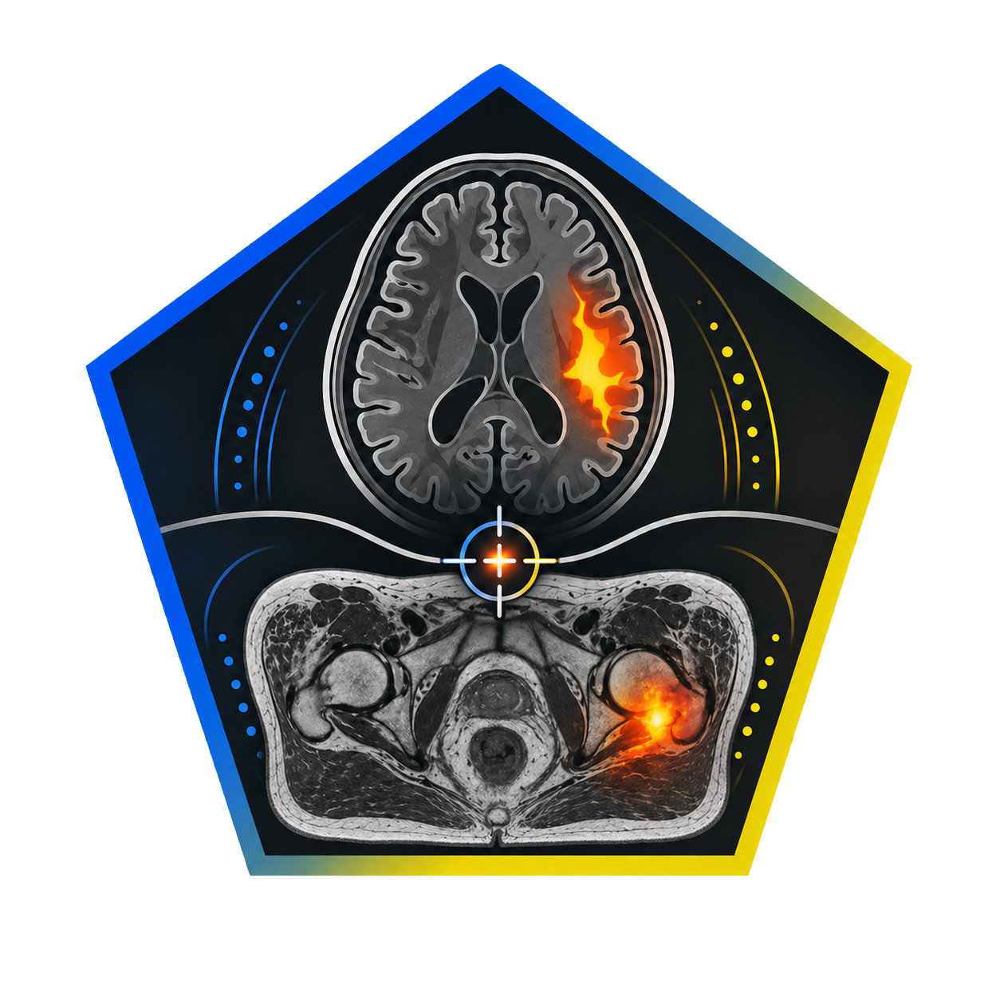

<div align="center">


<p align="center">
  
</p>

<p align="center">
  <a href="https://python.org"></a>
  <a href="https://pytorch.org"></a>
  <a href="https://project-monai.github.io/"></a>
  <a href="#"></a>
  <br>
  <a href="LICENSE"></a>
  <a href="https://github.com/MustafaKadhim/Anomaly-Detection-Self-supervised-anomaly-detection-for-medical-images/pulls"></a>
</p>

<div align="center">

<p>
  <a href="https://github.com/MustafaKadhim/Anomaly-Detection-Self-supervised-anomaly-detection-for-medical-images/stargazers">⭐ Star this repo</a> &nbsp;•&nbsp;
  <a href="https://github.com/MustafaKadhim/Anomaly-Detection-Self-supervised-anomaly-detection-for-medical-images/pulls">🤝 Contribute</a>
</p>

<picture>
  <source media="(prefers-color-scheme: dark)" srcset="https://raw.githubusercontent.com/platane/snk/output/github-contribution-grid-snake-dark.svg">
  <source media="(prefers-color-scheme: light)" srcset="https://raw.githubusercontent.com/platane/snk/output/github-contribution-grid-snake.svg">
  
</picture>

</div>


*A research-ready framework for detecting anomalies in medical images, exclusively using normal training samples.*

[🚀 Quickstart](#-quickstart) · [🔖 Citation](#-citation) · [🏗 Framework](#-framework) · [🧪 Experiments](#-experiments) · [📊 Results](#-results) · [📁 Repository Structure](#-repository-structure)


## 🌟 Why This Framework?

<table>
  <tr>
    <td width="50%">
      <h3>✅ Normal-based Training</h3>
      <p>Trains <b>exclusively on normal/healthy images</b> — zero anomalous labels required. Perfect for clinical settings where pathology annotations are scarce.</p>
    </td>
    <td width="50%">
      <h3>🧩 Plug & Play Architecture</h3>
      <p>Fully customizable tokenizers and transformers ready to adapt to new modalities and datasets.</p>
    </td>
  </tr>
  <tr>
    <td width="50%">
      <h3>📈 Reproducible Benchmarks</h3>
      <p>Two complete experiments (Pelvic & Brain MRI) with configs, training scripts, and evaluation pipelines ready to run.</p>
    </td>
    <td width="50%">
      <h3>🏥 Validated on Public Data</h3>
      <p>Tested on <a href="https://datahub.aida.scilifelab.se/10.23698/aida/lund-probe">LUND-PROBE</a>, <a href="https://brain-development.org/ixi-dataset/">IXI</a>, <a href="https://fastmri.med.nyu.edu/">fastMRI</a>, and <a href="https://github.com/microsoft/fastmri-plus">fastMRI+</a>.</p>
    </td>
  </tr>
</table>


</div>


---

## 🔖 Citation
If you find our work interesting, please cite us:
```
@inproceedings{
placeholder,
title={Catching MRI outliers: etc.......},
author={M. Kadhim. V. Rogiwski etc........},
booktitle={Phiro-2026 ........ },
year={2026},
url={Phiro-webpage ....... }
}
```

## 🏗 Framework

The core idea is fun & simple: train an autoencoder to perfectly reconstruct **healthy** images. At test time, anomalous regions produce high reconstruction error — forming a pixel-level **anomaly map**.

<div align="center">

</div>


> **Figure caption:** * To be added later!.*

---

## 🚀 Quickstart

### 1. Installation
```bash
# Clone repository
git clone https://github.com/MustafaKadhim/Anomaly-Detection-Self-supervised-anomaly-detection-for-medical-images.git
cd Anomaly-Detection-Self-supervised-anomaly-detection-for-medical-images

# Install in editable mode
pip install -e .
```


### Minimal Example

```python
import torch
from framework import AnomalyAutoencoder

# Build model
model = AnomalyAutoencoder(in_channels=1, latent_dim=256)

# Forward pass
x = torch.randn(1, 1, 128, 128)          # batch of 1 grayscale MRI slice
out = model(x)

print(out["reconstruction"].shape)        # (1, 1, 128, 128)
print(out["anomaly_map"].shape)           # (1, 1, 128, 128)
print(out["latent"].shape)                # (1, 256)
```

---


## 🧪 Experiments

Two independent experiments are provided, each with their own config, training script, and evaluation pipeline.

<table>
<tr>
<td width="50%" valign="top">

### 🦴 Pelvic MRI

| | |
|---|---|
| Modality | T2-weighted Pelvic MRI |
| Dataset | PROMISE12 |
| Image size | 128 × 128 |
| Latent dim | 256 |
| Epochs | 150 |

```bash
# Train
python experiments/pelvic_mri/train.py

# Evaluate
python experiments/pelvic_mri/evaluate.py \
  --checkpoint experiments/pelvic_mri/checkpoints/checkpoint_best.pth \
  --visualize
```

📂 [`experiments/pelvic_mri/`](experiments/pelvic_mri/)

</td>
<td width="50%" valign="top">

### 🧠 Brain MRI

| | |
|---|---|
| Modality | T1/T2-weighted Brain MRI |
| Dataset | BraTS + IXI |
| Image size | 128 × 128 |
| Latent dim | 512 |
| Epochs | 200 |

```bash
# Train
python experiments/brain_mri/train.py

# Evaluate
python experiments/brain_mri/evaluate.py \
  --checkpoint experiments/brain_mri/checkpoints/checkpoint_best.pth \
  --visualize
```

📂 [`experiments/brain_mri/`](experiments/brain_mri/)

</td>
</tr>
</table>

---

## 📊 Benchmark Results

> Results will be populated after running experiments. Submit a PR if you reproduce these benchmarks!

| Experiment | AUROC ↑ | AUPRC ↑ | FPR @ 95% TPR ↓ | Status |
|:---|:---:|:---:|:---:|:---:|
| **Pelvic MRI** | — | — | — | 🔄 Pending |
| **Brain MRI**  | — | — | — | 🔄 Pending |

<p align="center">
  <sub>↑ Higher is better &nbsp;•&nbsp; ↓ Lower is better</sub>
</p>

---

## 📁 Repository Structure

```
.
├── framework/                    # 🏗 Core reusable framework
│   ├── models/
│   │   ├── encoder.py            #   Residual convolutional encoder
│   │   ├── decoder.py            #   U-Net style decoder with skip connections
│   │   └── autoencoder.py        #   Full AnomalyAutoencoder model
│   ├── losses/
│   │   └── anomaly_loss.py       #   L1 + SSIM + Perceptual combined loss
│   ├── datasets/
│   │   └── medical_dataset.py    #   Generic medical image dataset loader
│   ├── trainers/
│   │   └── anomaly_trainer.py    #   Training loop with checkpointing + LR scheduling
│   └── utils/
│       ├── metrics.py            #   AUROC, AUPRC, FPR@95TPR, optimal threshold
│       └── visualization.py      #   Anomaly map, ROC curve, training curve plots
│
├── experiments/
│   ├── pelvic_mri/               # 🦴 Pelvic MRI experiment
│   │   ├── config.yaml           #   Hyperparameters
│   │   ├── train.py              #   Training script
│   │   ├── evaluate.py           #   Evaluation script
│   │   └── data/README.md        #   Dataset preparation guide
│   │
│   └── brain_mri/                # 🧠 Brain MRI experiment
│       ├── config.yaml
│       ├── train.py
│       ├── evaluate.py
│       └── data/README.md
│
├── figures/                      # 🎨 Visuals used in README
│   ├── logo.svg
│   └── architecture.svg
│
├── requirements.txt
├── setup.py
└── README.md
```

---

## ⚙️ Configuration

Every aspect of each experiment is controlled by its `config.yaml`:

```yaml
model:
  in_channels: 1        # 1 = grayscale, 3 = RGB
  latent_dim: 256       # Bottleneck size
  base_channels: 32     # Feature map width
  use_skip: true        # U-Net skip connections

training:
  num_epochs: 150
  batch_size: 16
  learning_rate: 1.0e-4
  l1_weight: 1.0
  ssim_weight: 1.0
  perceptual_weight: 0.1

evaluation:
  anomaly_score_reduction: "percentile95"  # mean | max | percentile95
```
---


## 📜 License

This project is licensed under the MIT License. See [LICENSE](LICENSE) for details.

---

<div align="center">

Made with ❤️ for the medical imaging research community


</div>
